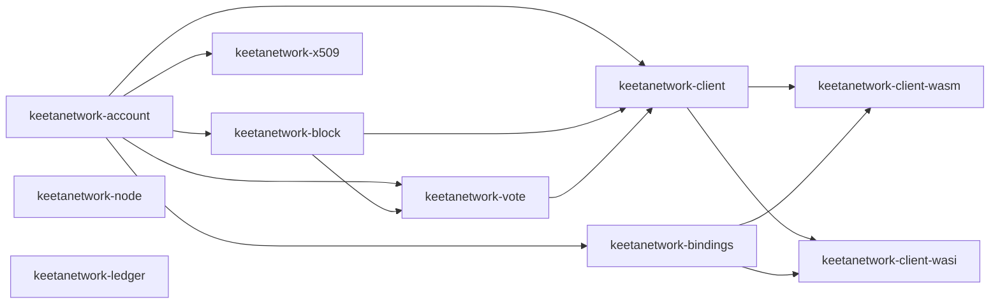

# Architecture

## Abstract

This page names the crate boundaries of the `node-rs` Cargo workspace. It states the cross-file contracts that a single crate rustdoc page cannot hold. It also names the two empty stub crates and the alternatives this tree rejects.

## Purpose

An engineer reads this page to name the crates in the workspace and the invariants that span them. After reading, the engineer can tell which crates are product surfaces, which crates are empty stubs, and which page or source file owns each contract.

## Related documents

- [Overview](README.md) for the cultural map and living index.
- [Quickstart](QUICKSTART.md) for install, build, test, and first use.
- [Documentation Standard](STANDARD.md) for page shape and the inclusion test.

## Workspace

This repository is a Cargo workspace. Root `Cargo.toml` lists the members under `[workspace].members`. The workspace resolver is `2`. The workspace excludes `keetanetwork-client-wasi/host-tests`.

The member crates on this tip are `keetanetwork-account`, `keetanetwork-error`, `keetanetwork-crypto`, `keetanetwork-x509`, `keetanetwork-asn1`, `keetanetwork-utils`, `keetanetwork-block`, `keetanetwork-vote`, `keetanetwork-ledger`, `keetanetwork-node`, `keetanetwork-client`, `keetanetwork-bindings`, `keetanetwork-client-wasm`, and `keetanetwork-client-wasi`.

Crate identity lives in each member `Cargo.toml` `description` plus rustdoc on that crate `lib.rs`. This page does not copy those export lists. Each member crate carries its own version in that crate `Cargo.toml`.

## Crate-boundary map

Account identities flow into block, vote, x509, client, and bindings. The client re-exports vote types for callers. Bindings project the same core into wasm and WASI.

`crate_node` and `crate_ledger` sit in the workspace with no product types. The arrows follow member `Cargo.toml` dependencies on this tip. The `crate_client` to `crate_wasi` arrow is the `p2` feature. Feature `p1` stays on the pure surface.

## Cross-file contracts

These statements hold across crates. rustdoc on each type remains the field reference.

### Identities

`keetanetwork-account` owns `Account`, `GenericAccount`, `KeyPairType`, and identifier accounts. `keetanetwork-block`, `keetanetwork-vote`, `keetanetwork-x509`, `keetanetwork-client`, and `keetanetwork-bindings` consume those identities. `CertSigner` and `CertVerifier` live on the account crate. Certificate builders and stores live in `keetanetwork-x509`.

### Feature gates

Workspace crates share `std`, `alloc`, `der`, and `rasn` feature names. `keetanetwork-asn1/src/lib.rs` fails the build when neither `der` nor `rasn` is on. That `compile_error!` requires at least one of those features. Both features may be on together.

`keetanetwork-client` feature `http` requires a runtime. Native builds enable `std`. Browser builds enable `wasm` on `wasm32-unknown-unknown`. The crate `compile_error!` states that pairing.

### Blocks and votes

`Block`, `BlockBuilder`, `Operation`, and `AccountRef` live in `keetanetwork-block`. Opening-hash and signing rules span that crate and the client builder. The rustdoc example in `keetanetwork-block/src/lib.rs` shows `as_opening` and `sign`.

`Vote`, `VoteQuote`, `VoteStaple`, and `PossiblyExpiredVote` live in `keetanetwork-vote`. A quote is a non-binding vote used during fee negotiation. A staple is the compressed bundle of votes and the blocks they cover. `keetanetwork-client` re-exports `Vote`, `VoteQuote`, and `VoteStaple`.

### Client transport

`KeetaClient`, `UserClient`, and `TransactionBuilder` live in `keetanetwork-client`. HTTP transport is generated at build time from `keetanetwork-client/openapi/keetanet-node.yaml` through progenitor. The generated types are exposed as the `generated` module when the `codec` feature is on.

The rustdoc example in `keetanetwork-client/src/lib.rs` constructs `KeetaClient::new("http://localhost:8080/api")`. [Quickstart](QUICKSTART.md) cites that example.

### Bindings

`keetanetwork-bindings` is the shared, target-agnostic projection. `keetanetwork-client-wasm` is the browser ABI. Amounts are decimal strings. Errors carry `error.code`. `keetanetwork-client-wasi` selects exactly one of `p1` or `p2` on a WASI target. Both features on, or neither feature on, fail that crate `compile_error!`.

## Stub crates

`keetanetwork-node` is an empty stub. `keetanetwork-node/src/lib.rs` holds crate docs only. That file exports no types on this tip.

`keetanetwork-ledger` is an empty stub. `keetanetwork-ledger/src/lib.rs` holds crate docs only. That file exports no types on this tip.

This page names those crates as stubs only.

## Rejected alternatives

These decisions stay closed. A later change that reopens one is a migration.

| Decision | Rejected alternative | Why the alternative lost |
| --- | --- | --- |
| Crate identity lives in each `Cargo.toml` plus rustdoc | One README barrel per member crate | A barrel restates `pub use` and fails the inclusion test |
| Examples stay in crate rustdoc and tests | An `examples/` directory | No such directory exists on this tip. Scope keeps examples in-crate |
| Architecture names node and ledger as stubs | A node or ledger product page | Those `lib.rs` files export no types |
| Quickstart holds the PAT and Packages fact | Revival of branch `docs/add_pat_instructions` | That branch is stale and still taught `make release` as a release build |
| License strings are cited as the files write them | A docs-only license reconcile | Overview cites the three file strings. This tree does not edit `LICENSE` |

## Falsified by

A change to the workspace `members` or `exclude` lists in root `Cargo.toml`. A change that adds types to `keetanetwork-node/src/lib.rs` or `keetanetwork-ledger/src/lib.rs`. A change to the `compile_error!` in `keetanetwork-asn1/src/lib.rs`, `keetanetwork-client/src/lib.rs` feature `http`, or `keetanetwork-client-wasi/src/lib.rs` `p1` / `p2`. A change to the OpenAPI path `keetanetwork-client/openapi/keetanet-node.yaml` or to the client `generated` module gate.
