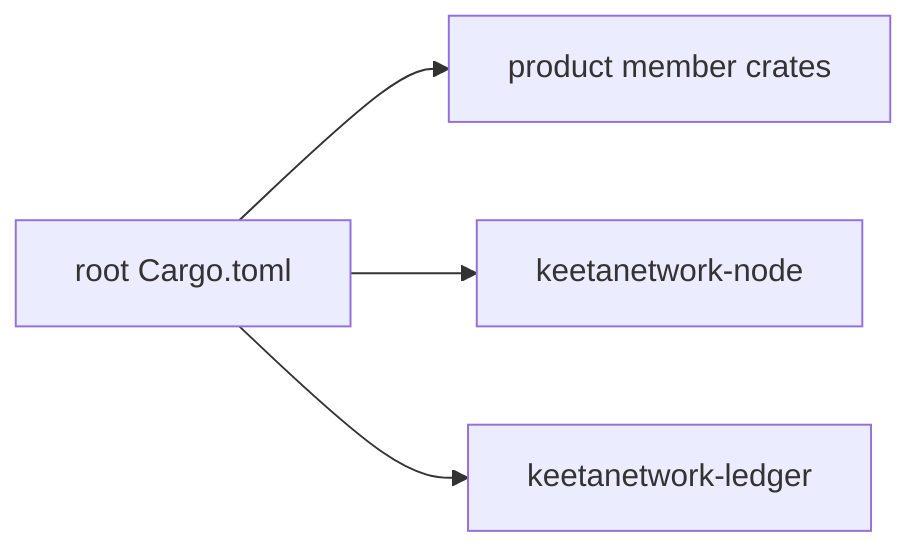

# Architecture

## Abstract

This page names the crate boundaries of the `node-rs` Cargo workspace. A later documentation pass fills the cross-file invariants and the rejected alternatives. This page records the workspace members and the two empty stub crates.

## Purpose

An engineer reads this page to name the crates in the workspace. After reading, the engineer can tell which crates are product surfaces and which crates are empty stubs.

## Related documents

- [Overview](README.md) for the cultural map and living index.
- [Quickstart](QUICKSTART.md) for install and build.
- [Documentation Standard](STANDARD.md) for page shape and the inclusion test.

## Workspace

This repository is a Cargo workspace. Root `Cargo.toml` lists the members under `[workspace].members`. The workspace resolver is `2`. The workspace excludes `keetanetwork-client-wasi/host-tests`.

The member crates on this tip are `keetanetwork-account`, `keetanetwork-error`, `keetanetwork-crypto`, `keetanetwork-x509`, `keetanetwork-asn1`, `keetanetwork-utils`, `keetanetwork-block`, `keetanetwork-vote`, `keetanetwork-ledger`, `keetanetwork-node`, `keetanetwork-client`, `keetanetwork-bindings`, `keetanetwork-client-wasm`, and `keetanetwork-client-wasi`.

Crate identity lives in each member `Cargo.toml` `description` plus rustdoc on that crate `lib.rs`. This page does not copy those export lists.

A later documentation pass fills the crate-boundary invariants, the rejected alternatives, and the enforcement points.

## Stub crates

`keetanetwork-node` is an empty stub. `keetanetwork-node/src/lib.rs` holds crate docs only. That file exports no types on this tip.

`keetanetwork-ledger` is an empty stub. `keetanetwork-ledger/src/lib.rs` holds crate docs only. That file exports no types on this tip.

This page names those crates as stubs only.

`crate_node` and `crate_ledger` are the stub ids. A later pass may split `crate_product` into one id per member once those invariants have a home.

## Falsified by

A change to the workspace `members` or `exclude` lists in root `Cargo.toml`. A change that adds types to `keetanetwork-node/src/lib.rs` or `keetanetwork-ledger/src/lib.rs`.
