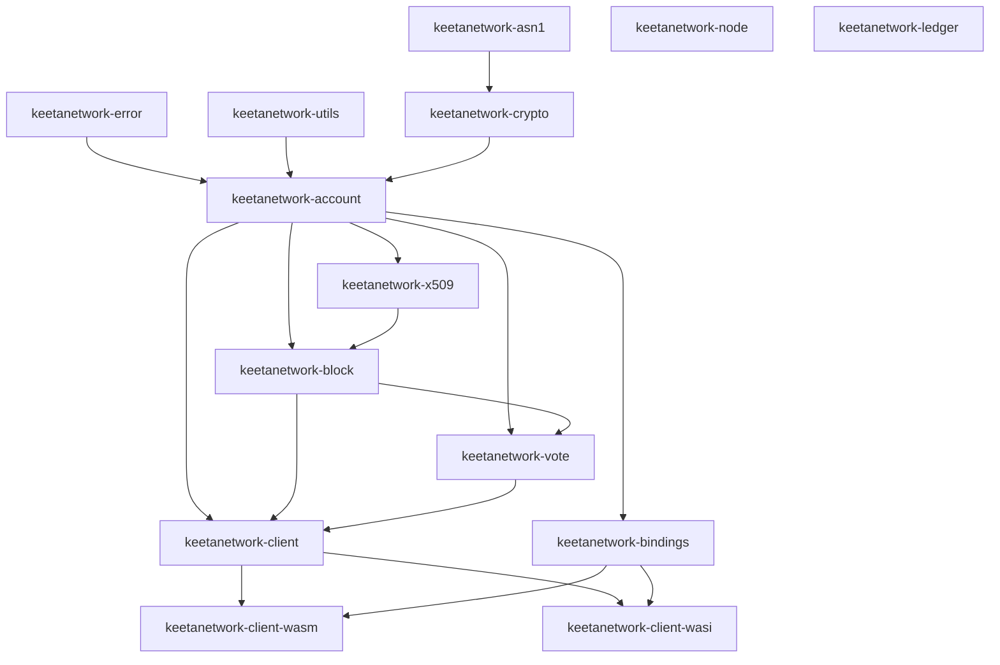

# Architecture

## Abstract

This page states how the `node-rs` workspace crates depend on each other and how they collaborate on a signed write. It holds the crate-boundary graph and the interaction path that no single crate rustdoc can show. Per-crate consumer contracts live under [Crate notes](crates/account.md) and the sibling pages listed on [Overview](README.md).

## Purpose

An engineer reads this page to learn how work moves from an account identity through a block, a vote staple, the HTTP client, and the host ABIs. After reading, the engineer can name the crate that owns each step and open the crate note that holds that crate's consumer contract.

## Related documents

- [Overview](README.md) for the cultural map and the crate-note table of contents.
- [Quickstart](QUICKSTART.md) for install, build, test, and first use.
- [Documentation Standard](STANDARD.md) for the inclusion test and page shape.

## Collaboration graph

The workspace lists fourteen members in root `Cargo.toml`. Twelve of those members are product crates. `keetanetwork-node` and `keetanetwork-ledger` keep reserved names. Their `lib.rs` files export no types on this tip.

The arrows follow member `Cargo.toml` path dependencies that the product path uses. Foundation crates feed identity. Identity feeds signed objects. Signed objects feed the client. The client and the shared bindings crate feed the browser and WASI ABIs.

`crate_node` and `crate_ledger` sit in the workspace with no product types. The `crate_client` to `crate_wasi` arrow is the `p2` feature. Feature `p1` stays on the pure surface.

Each crate note names the remaining `Cargo.toml` edges that this diagram omits, such as `keetanetwork-asn1` into `keetanetwork-block` and `keetanetwork-vote`.

## How the crates interact

A signed write walks one path.

An account crate identity starts the path. `keetanetwork-account` owns `Account`, `GenericAccount`, `KeyPairType`, and identifier accounts. Higher crates take those types. They do not invent a second identity model. `CertSigner` and `CertVerifier` live on the account crate. Certificate builders and stores live in `keetanetwork-x509`.

`keetanetwork-block` turns that identity into a signed object. `Block`, `BlockBuilder`, `Operation`, and `AccountRef` live there. Opening-hash and signing rules live in that crate. The client builder uses the same rules when it assembles a first block or a successor.

`keetanetwork-vote` commits those block hashes. A `Vote` is a representative's signed commitment. A `VoteQuote` is a non-binding vote used during fee negotiation. A `VoteStaple` is the compressed bundle of votes and the blocks they cover. `keetanetwork-client` re-exports `Vote`, `VoteQuote`, and `VoteStaple` for callers.

`keetanetwork-client` is the orchestrator. `KeetaClient`, `UserClient`, and `TransactionBuilder` live there. HTTP transport is generated at build time from `keetanetwork-client/openapi/keetanet-node.yaml` through progenitor. The generated types are exposed as the `generated` module when the `codec` feature is on. The rustdoc example in `keetanetwork-client/src/lib.rs` constructs `KeetaClient::new("http://localhost:8080/api")`.

`keetanetwork-bindings` is the shared, target-agnostic projection. It maps account algorithms, parses host input, and reduces core errors. `keetanetwork-client-wasm` is the browser ABI. Amounts are decimal strings. Errors carry `error.code`. `keetanetwork-client-wasi` selects exactly one of `p1` or `p2` on a WASI target.

Foundation crates sit under that path. `keetanetwork-error` holds shared error types. `keetanetwork-crypto` holds algorithm-agnostic primitives. `keetanetwork-asn1` holds the encoding codecs. `keetanetwork-utils` holds test macros, the `build` helpers, and the `node-harness` feature that [Quickstart](QUICKSTART.md) names as the Packages gate.

## Build contracts that span crates

These statements are the positive feature contracts that more than one crate must honor.

`keetanetwork-asn1` enables at least one of `der` or `rasn`. Both features may be on together. The `compile_error!` in `keetanetwork-asn1/src/lib.rs` is the enforcement point. Higher crates that expose `der` or `rasn` forward those names to `keetanetwork-asn1`.

`keetanetwork-client` feature `http` pairs with a runtime. Native builds enable `std`. Browser builds enable `wasm` on `wasm32-unknown-unknown`. The `compile_error!` in `keetanetwork-client/src/lib.rs` is the enforcement point.

`keetanetwork-client-wasi` selects exactly one of `p1` or `p2` on a WASI target. Feature `p2` pulls `keetanetwork-client`. Feature `p1` stays on the pure surface. The `compile_error!` in `keetanetwork-client-wasi/src/lib.rs` is the enforcement point.

Workspace crates share the `std` and `alloc` feature names so a `no_std` consumer can stay on `alloc` through the identity and object crates.

## Crate-note homes

Each product crate has one note. The note holds that crate's consumer contract and the crates that call it. This page does not copy those contracts.

| Crate | Note |
| --- | --- |
| `keetanetwork-account` | [Account](crates/account.md) |
| `keetanetwork-error` | [Error](crates/error.md) |
| `keetanetwork-crypto` | [Crypto](crates/crypto.md) |
| `keetanetwork-x509` | [X.509](crates/x509.md) |
| `keetanetwork-asn1` | [ASN.1](crates/asn1.md) |
| `keetanetwork-utils` | [Utils](crates/utils.md) |
| `keetanetwork-block` | [Block](crates/block.md) |
| `keetanetwork-vote` | [Vote](crates/vote.md) |
| `keetanetwork-client` | [Client](crates/client.md) |
| `keetanetwork-bindings` | [Bindings](crates/bindings.md) |
| `keetanetwork-client-wasm` | [Client wasm](crates/client-wasm.md) |
| `keetanetwork-client-wasi` | [Client WASI](crates/client-wasi.md) |

`keetanetwork-node` and `keetanetwork-ledger` have no crate note. Those `lib.rs` files export no types. This page is the home that names them as stubs.

Crate identity, versions, and field lists live in each member `Cargo.toml` and in rustdoc. This tree does not copy those lists.

## Falsified by

A change to the workspace `members` or `exclude` lists in root `Cargo.toml`. A change that adds product types to `keetanetwork-node/src/lib.rs` or `keetanetwork-ledger/src/lib.rs`. A change to the `compile_error!` gates in `keetanetwork-asn1/src/lib.rs`, `keetanetwork-client/src/lib.rs` (`http` runtime pairing), or `keetanetwork-client-wasi/src/lib.rs` (`p1` / `p2`). A change that moves the OpenAPI document away from `keetanetwork-client/openapi/keetanet-node.yaml`. A change to the product-crate set that [Overview](README.md) indexes under `docs/crates/`.
