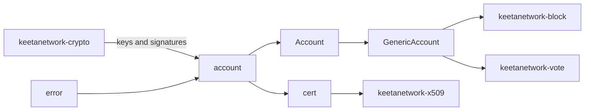

# Account

## Abstract

This page is the internal design of `keetanetwork-account`. The crate turns seeds and key material into typed identities, then erases the algorithm at crate boundaries. Neighbor crates consume those identities. They do not invent a second account model.

## Purpose

An engineer reads this page before changing how an identity is constructed or shared. After reading, the engineer can name the module that owns typing, erasure, certificate-mode signing, and errors.

## Internal design

`account` owns `Account`, `GenericAccount`, `KeyPairType`, and identifier accounts. A typed `Account` is bound to one algorithm marker such as `KeyED25519`. `GenericAccount` is the type-erased form that block, vote, and client carry across crate edges. Identifier kinds (`NETWORK`, `TOKEN`, `STORAGE`, `MULTISIG`) are accounts that do not sign.

`cert` owns `CertSigner` and `CertVerifier`. Certificate mode is the message-handling convention used by vote certificates and other X.509-shaped artifacts. ECDSA signs a SHA3-256 digest as DER `r` and `s`. Ed25519 signs the message directly. Identifier accounts cannot sign or verify in this mode.

`error` owns `AccountError`. `constants` holds shared numeric and string constants. `utils` holds small helpers used by account construction. `doc_utils` is documentation-only test-key construction.

## Collaboration

Inbound: `keetanetwork-crypto` supplies derivation, signing, and encryption. `keetanetwork-error` and `keetanetwork-utils` sit under those paths. `keetanetwork-asn1` is optional behind `der` and `rasn`.

Outbound: `keetanetwork-block` wraps `GenericAccount` as `AccountRef`. `keetanetwork-vote` uses that same `AccountRef` as a vote issuer. `keetanetwork-x509` calls `CertSigner` and `CertVerifier`. `keetanetwork-client` and `keetanetwork-bindings` take identities at the HTTP and host ABI edges.

## Feature contract

Default features are `std` and `rasn`. `std` implies `alloc`. Features `der` and `rasn` forward to `keetanetwork-asn1` and `keetanetwork-crypto`. A `no_std` consumer enables `alloc` and at least one codec when it needs the ASN.1 path.

## Falsified by

A change that moves `Account`, `GenericAccount`, `KeyPairType`, `CertSigner`, or `CertVerifier` off this crate. A change that adds a second identity model in block, vote, x509, client, or bindings. A change to the `der` / `rasn` forwarding in `keetanetwork-account/Cargo.toml`.
