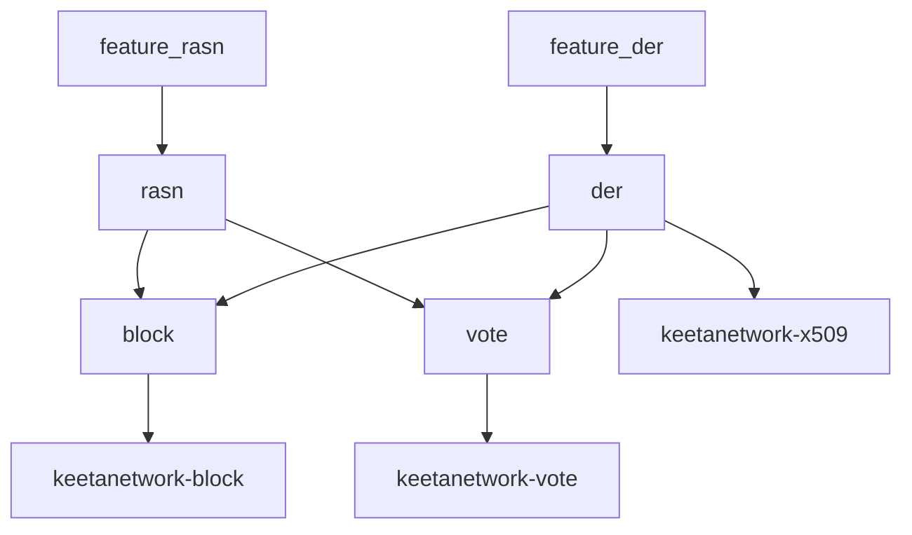

# ASN.1

## Abstract

This page is the internal design of `keetanetwork-asn1`. The crate is the shared codec layer. Identity, certificate, block, and vote types encode through at least one of `der` or `rasn`.

## Purpose

An engineer reads this page before changing a codec feature or adding a third ASN.1 stack. After reading, the engineer knows how the `der` and `rasn` backends sit under the block and vote transport modules.

## Internal design

`der` is the `der` crate backend. `rasn` is the `rasn` crate backend. When both features are on, unprefixed re-exports prefer `der` so x509, account, and crypto keep their legacy surface. `BitStringExt` and `ObjectIdentifierExt` surface whenever `rasn` is on.

`block` and `vote` are backend-neutral transport modules. They require `chrono` plus at least one codec. `asn1_time` owns `Asn1Time`. `oids` owns shared object identifiers. `utils` owns small codec helpers. `error` owns `Asn1Error`.

`generated` and `schema_codec` are rasn-only generation and positional DER paths. `testing` is present when `testing` and `der` are on.

## Collaboration

Inbound: `keetanetwork-utils` is a path dependency. The `build` feature on that crate supplies generation helpers used by this crate's build script.

Outbound: account, crypto, x509, block, vote, and bindings crates depend on this crate when they encode or decode shared structures. Those crates expose `der` and `rasn` under the same names and forward them here.

## Feature contract

A consumer enables at least one of `der` or `rasn`. Both features may be on together. The `compile_error!` in `keetanetwork-asn1/src/lib.rs` is the enforcement point. Default features are `std`, `serde`, and `rasn`. `std` implies `alloc`.

## Falsified by

A change to the `compile_error!` that no longer requires at least one of `der` or `rasn`. A change that adds a third codec feature without updating this page. A change that stops account, block, or vote from forwarding `der` and `rasn` here.
