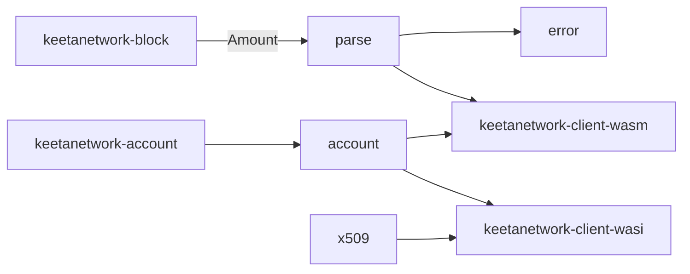

# Bindings

## Abstract

This page is the internal design of `keetanetwork-bindings`. The crate is the shared, target-agnostic projection. Browser and WASI ABIs call these modules so each host does not grow a second parser or algorithm map.

## Purpose

An engineer reads this page before adding host-facing parsing in `keetanetwork-client-wasm` or `keetanetwork-client-wasi`. After reading, the engineer knows which module owns amounts, algorithms, errors, and certificates.

## Internal design

`parse` owns decimal `amount` parsing, adjust methods, purposes, and permission flag names. Rejected input becomes `ParseError` with a stable `code` such as `INVALID_AMOUNT`.

`account` owns `CRYPTO_ALGORITHMS`, `algorithm_name`, seed and public-key construction, and sign, verify, encrypt, and decrypt helpers. The default algorithm name is `ecdsa_secp256k1`. Identifier accounts map to `"other"`.

`error` owns `CodedError`, the reduced error shape hosts throw. `permissions` owns permission projection. `x509` owns certificate DER and PEM helpers. `time` owns moment parsing. `registry` owns small lookup tables. `client` is present when the `client` feature is on and pulls `keetanetwork-client`.

## Collaboration

Inbound: account, crypto, block, vote, x509, and asn1 crates are path dependencies with `alloc` and `rasn`. Feature `client` pulls `keetanetwork-client`.

Outbound: `keetanetwork-client-wasm` depends on this crate with the `client` feature. `keetanetwork-client-wasi` depends on this crate on every build. Feature `p2` on the WASI crate also enables `keetanetwork-bindings/client`.

## Feature contract

Default features include `std`. Feature `client` is opt-in. A target crate that only needs the pure projection leaves `client` off.

## Falsified by

A change that moves account-algorithm mapping or core-error reduction into wasm or WASI without this crate. A change to the `client` feature in `keetanetwork-bindings/Cargo.toml`. A change that drops this crate from either host ABI crate.
