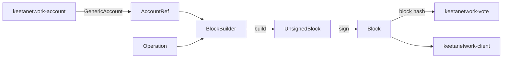

# Block

## Abstract

This page is the internal design of `keetanetwork-block`. The crate turns an account identity and a list of operations into a signed block. Opening-hash and successor rules live here. Vote and client consume the resulting hashes and bytes.

## Purpose

An engineer reads this page before changing how a first block or a successor is signed. After reading, the engineer can name the path from `BlockBuilder` through `UnsignedBlock` to `Block`, and which operation variants that builder accepts.

## Internal design

`builder` owns `BlockBuilder`. The builder collects network, account, previous hash, and operations. `as_opening` selects the opening previous. `with_previous` selects a successor. `build` produces `UnsignedBlock`.

`block` owns `UnsignedBlock`, `Block`, `BlockData`, `BlockPurpose`, and `Signature`. `UnsignedBlock::sign` attaches the account signature and yields `Block`. `Block::try_from` decodes bytes. `Hashable` comes from `keetanetwork-crypto` and is re-exported as `BlockHash`.

`operation` owns `Operation` and `OperationType`. Variants are `Send`, `SetRep`, `SetInfo`, `ModifyPermissions`, `CreateIdentifier`, `TokenAdminSupply`, `TokenAdminModifyBalance`, `Receive`, and `ManageCertificate`. Each variant validates itself against the surrounding block.

`signer` owns `AccountRef` and `Signer`. `AccountRef` wraps `GenericAccount` from the account crate. `account_util` is crate-private dispatch over `GenericAccount` variants for parse, verify, and equality. `amount` owns `Amount`. `permissions` owns permission flags and groups. `time` owns `BlockTime`. `validation` owns `ValidationConfig` and text rules. `transport` owns byte encoding. `error` owns `BlockError`. `testing` is present when the `testing` feature is on.

## Collaboration

Inbound: `keetanetwork-account` supplies the identity inside `AccountRef`. `keetanetwork-crypto` supplies `Hashable` and signatures. `keetanetwork-asn1` and `keetanetwork-x509` supply encoding and certificate material for `ManageCertificate`.

Outbound: `keetanetwork-vote` covers block hashes. `keetanetwork-client` assembles blocks through `TransactionBuilder` using the same opening-hash and signing rules. Bindings and host ABI crates project the same block types.

## Feature contract

Default features are `std` and `rasn`. `std` implies `alloc`. Features `der` and `rasn` forward to asn1, account, crypto, and x509. A `no_std` consumer enables `alloc` and at least one codec.

## Falsified by

A change to `Block`, `BlockBuilder`, `UnsignedBlock`, `Operation`, or `AccountRef` ownership. A change that lets the client compute an opening hash without this crate. A change to the rustdoc example in `keetanetwork-block/src/lib.rs`.
