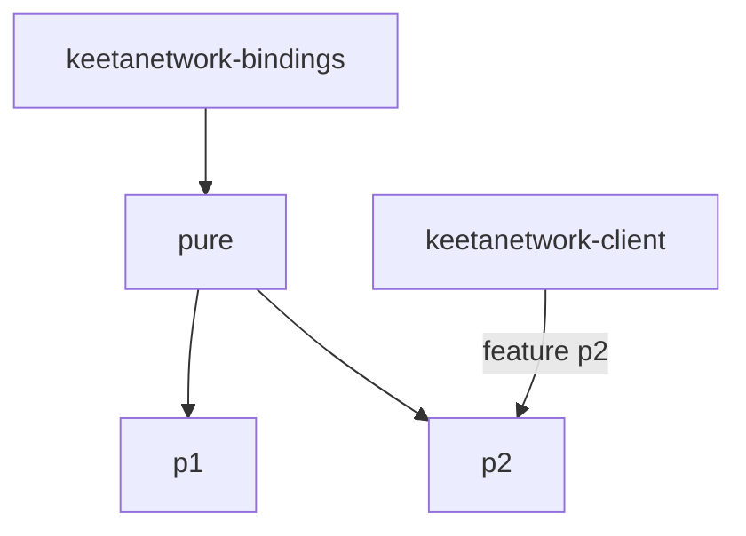

# Client WASI

## Abstract

This page is the internal design of `keetanetwork-client-wasi`. The crate is two feature-selected WASI flavors over one shared `pure` module. Feature `p2` networks. Feature `p1` stays on the pure surface.

## Purpose

An engineer reads this page before changing a WASI feature or adding a second networking path on `p1`. After reading, the engineer knows which module is shared, which module is P1, and which module is P2.

## Internal design

`pure` is always compiled. It re-exports account and certificate helpers from `keetanetwork-bindings` and adds block, vote, and identifier operations that both ABIs call. Off a WASI target, `p1` and `p2` compile out and leave `pure`.

`p1` is present when feature `p1` is on and the target is WASI. It is a core module over a flat ABI. P1 has no outbound `connect`. The host dials.

`p2` is present when feature `p2` is on and the target is WASI. It is a `wit-bindgen` component that networks over `wasi:http`. That feature pulls `keetanetwork-client` with the `wasi` feature and enables `keetanetwork-bindings/client`.

A WASI build enables exactly one of `p1` or `p2`. The `compile_error!` in `keetanetwork-client-wasi/src/lib.rs` is the enforcement point.

## Collaboration

Inbound: this crate always depends on account, block, crypto, vote, x509, and bindings. Feature `p2` adds `keetanetwork-client`.

Outbound: host tests under `keetanetwork-client-wasi/host-tests/` exercise P1 and P2 artifacts. `make build-wasi` and `make test-wasi` select `p1` for `wasm32-wasip1` and `p2` for `wasm32-wasip2`.

## Feature contract

Select exactly one of `p1` or `p2` per WASI build. Feature `p2` is the only edge from this crate to `keetanetwork-client`. Feature `p1` stays on the pure surface.

## Falsified by

A change to the `compile_error!` in `keetanetwork-client-wasi/src/lib.rs`. A change that lets a WASI build enable both `p1` and `p2`, or neither. A change that pulls `keetanetwork-client` on feature `p1`. A change to the `p1` / `p2` selection in the `Makefile` `build-wasi` or `test-wasi` targets.
