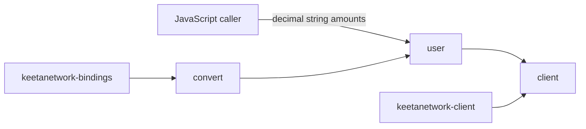

# Client wasm

## Abstract

This page is the internal design of `keetanetwork-client-wasm`. The crate is the browser ABI. It projects `keetanetwork-client` and `keetanetwork-bindings` into JavaScript. Amounts stay decimal strings. Errors carry `error.code`.

## Purpose

An engineer reads this page before changing the browser ABI or adding a JavaScript `number` amount. After reading, the engineer can name which module owns the client, the user facade, and the conversions that keep amounts as strings.

## Internal design

`client` and `user` own the JavaScript `KeetaClient` and `UserClient`. `builder` and `block_builder` own multi-operation assembly on the JS side. `account` owns seed and public-key construction. `block`, `vote`, `certificate`, and `x509` project those domain types.

`convert` and `dto` own the boundary conversions. Amounts become decimal strings. Cryptographic bytes become `Uint8Array`. Hashes and keys become hex strings. `options` owns `TransmitOptions`. `permissions`, `rep`, `pending`, and `swap` project the remaining client surfaces.

The crate is gated to `wasm32-unknown-unknown`. It depends on `keetanetwork-client` with the `wasm` feature so `http` pairs with `WasmRuntime`.

## Collaboration

Inbound: `keetanetwork-client` with `wasm`, `keetanetwork-bindings` with `client`, plus account, block, crypto, x509, and asn1.

Outbound: this crate is a leaf ABI. Browser callers import the `wasm-pack` package. They do not take a Rust path dependency on the other workspace crates.

## Feature contract

The client `wasm` feature enables `http` on `wasm32-unknown-unknown`. That pairing satisfies the `compile_error!` in `keetanetwork-client/src/lib.rs`. Amounts are decimal strings. Errors are JavaScript `Error` objects that carry `error.code`.

## Falsified by

A change that accepts a JavaScript `number` as an amount. A change that drops `error.code` from thrown errors. A change that builds this crate without client feature `wasm` or bindings feature `client`.
