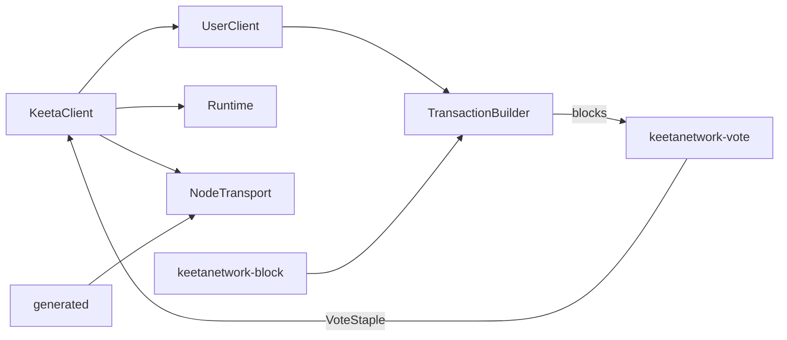

# Client

## Abstract

This page is the internal design of `keetanetwork-client`. The crate is the orchestrator. It assembles blocks with the same rules as `keetanetwork-block`, then transmits vote staples through a generated HTTP transport.

## Purpose

An engineer reads this page before changing client construction, HTTP generation, or the `http` runtime pairing. After reading, the engineer can name the path from `KeetaClient` through `TransactionBuilder` and `UserClient` to the generated transport.

## Internal design

`client` owns `KeetaClient`. Construction is `KeetaClient::new` plus `with_network`, or `with_parts` for a `no_std` consumer that supplies a `Runtime` and a `NodeTransport`.

`builder` owns `TransactionBuilder`. It assembles operations into blocks using block opening-hash and signing rules. `user` owns `UserClient`. A `UserClient` binds a signer and an optional operating account. Writes originate for the account and are signed by the bound signer. A client without a signer is read-only.

`transport` owns `NodeTransport` and `TransportFactory`. Feature `http` generates the HTTP client from `keetanetwork-client/openapi/keetanet-node.yaml` through progenitor into the `generated` module when `codec` is on. `runtime` owns `Runtime`, `TokioRuntime` on `std`, `WasmRuntime` on `wasm`, and `WasiRuntime` on `wasi`.

`model` owns query and response types. `rep` owns representative selection. `network` is present with `http`. `config` owns `ClientConfig`. `codec` owns transport-agnostic encoding when the `codec` feature is on. `genesis` owns network initialization helpers. `swap` owns swap request types. `math` owns quorum and backoff helpers. `sync` owns the `no_std` lock primitives that the orchestrator shares. `marker` owns `MaybeSend` and `MaybeSync`. `error` owns `ClientError`.

## Collaboration

Inbound: `keetanetwork-account` supplies `AccountRef`. `keetanetwork-block` supplies opening-hash and signing. `keetanetwork-vote` supplies vote types that this crate re-exports. `keetanetwork-error` supplies `KeetaNetError`, also re-exported.

Outbound: `keetanetwork-client-wasm` enables the `wasm` feature. `keetanetwork-client-wasi` enables this crate only on feature `p2`. `keetanetwork-bindings` takes this crate behind its `client` feature.

## Feature contract

Default features include `std`. Feature `std` enables `http` and a native Tokio runtime. Feature `wasm` enables `http` on `wasm32-unknown-unknown`. Feature `wasi` enables `codec` without pulling Tokio. Feature `http` pairs with a runtime. The `compile_error!` in `keetanetwork-client/src/lib.rs` is the enforcement point. The orchestrator is `no_std` plus `alloc` when `std`, `http`, and `wasi` are off.

## Falsified by

A change to `KeetaClient`, `UserClient`, or `TransactionBuilder` ownership. A change that moves the OpenAPI document away from `keetanetwork-client/openapi/keetanet-node.yaml`. A change to the `compile_error!` that pairs `http` with a runtime.
