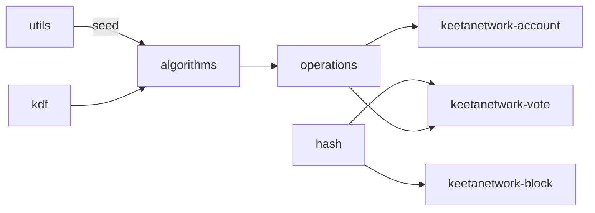

# Crypto

## Abstract

This page is the internal design of `keetanetwork-crypto`. The crate is the algorithm-agnostic primitive layer. Account, block, and vote crates derive keys, hash, and sign through these modules. They do not embed a second crypto stack.

## Purpose

An engineer reads this page before adding a signing or hashing path in a higher crate. After reading, the engineer can name the module that owns algorithms, hashes, KDF, and secret handling.

## Internal design

`algorithms` owns secp256k1, secp256r1, and Ed25519 derivation and key types. `hash` owns `HashAlgorithm`, `hash_default`, `Hashable`, and `BlockHash`. `kdf` owns HKDF-style derivation used by some algorithms. `operations` owns higher-level sign and encrypt entry points. `verify` owns verification helpers.

`utils` owns `generate_random_seed` and related byte helpers. `prelude` re-exports `IntoSecret`, `ExposeSecret`, and the traits higher crates import. `bigint` owns big-integer helpers used by encodings. `error` owns `CryptoError`. `constants` holds algorithm constants. `test_utils` is present in test builds.

## Collaboration

Inbound: `keetanetwork-utils` is a path dependency. `keetanetwork-error` is optional and comes on with `std`. `keetanetwork-asn1` is optional behind `der` and `rasn`.

Outbound: `keetanetwork-account` enables `signature` and `encryption`. `keetanetwork-block` and `keetanetwork-vote` enable `signature` and hash through `Hashable`. `keetanetwork-x509`, `keetanetwork-client`, and `keetanetwork-bindings` call the same primitives.

## Feature contract

Default features are `std`, `signature`, `encryption`, and `rasn`. `std` implies `alloc`. Features `der` and `rasn` forward to optional `keetanetwork-asn1`. A `no_std` consumer enables `alloc` plus `signature` or `encryption` as the call site needs.

## Falsified by

A change that moves hashing or signing primitives out of this crate. A change that lets account, block, or vote sign without this crate. A change to the `signature`, `encryption`, `der`, or `rasn` features in `keetanetwork-crypto/Cargo.toml`.
