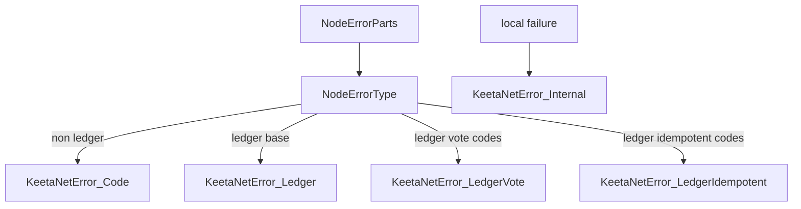

# Error

## Abstract

This page is the internal design of `keetanetwork-error`. The crate is a single-module envelope. It turns a node error `type` field into `NodeErrorType`, then builds a typed `KeetaNetError` from decoded parts.

## Purpose

An engineer reads this page before adding a crate-local error envelope that callers must learn twice. After reading, the engineer knows how a node envelope becomes `Code`, `Ledger`, `LedgerVote`, or `LedgerIdempotent`.

## Internal design

The crate has no submodule split. `NodeErrorType` is the category taken from the envelope `type` field. Known categories are `Account`, `Api`, `Block`, `Certificate`, `Client`, `Kv`, `Ledger`, `Permissions`, `Vote`, and `Generic`.

`NodeErrorParts` is the decoded envelope used to construct `KeetaNetError`. Non-ledger kinds collapse to `KeetaNetError::Code`. Ledger codes in `LEDGER_NOT_SUCCESSOR` and `LEDGER_NOT_OPENING` become `LedgerVote` when accounts are present. `LEDGER_IDEMPOTENT_KEY_EXISTS` becomes `LedgerIdempotent` when both block hashes are present. Other ledger codes become `Ledger` and may carry retry data.

`KeetaNetError` also has `Internal`, `Unknown`, and `NotImplemented` for local failures that are not node envelopes. `node_type` recovers a category from a coded variant by reading the code prefix.

## Collaboration

Inbound: this crate depends only on `snafu`. It does not depend on other workspace crates.

Outbound: `keetanetwork-account`, `keetanetwork-block`, `keetanetwork-vote`, `keetanetwork-x509`, and `keetanetwork-client` return or wrap these types. `keetanetwork-client` re-exports `KeetaNetError` and `NodeErrorType`. `keetanetwork-crypto` takes this crate only when `std` is on.

## Feature contract

Default features include `std`. `std` implies `alloc`. The crate builds under `no_std` with `alloc`.

## Falsified by

A change to `KeetaNetError` or `NodeErrorType` in `keetanetwork-error/src/lib.rs`. A change that drops the client re-export of those two types. A change to the ledger code tables that select `LedgerVote` or `LedgerIdempotent`.
