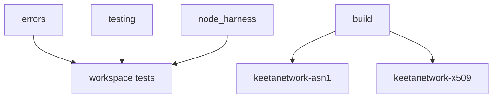

# Utils

## Abstract

This page is the internal design of `keetanetwork-utils`. The crate is shared tooling under the product path. It owns test macros, optional ASN.1 build helpers, and the node harness client.

## Purpose

An engineer reads this page before adding a workspace-wide test helper or changing the harness feature. After reading, the engineer knows which module is compile-time, which module is test-only, and which module talks to GitHub Packages.

## Internal design

`testing` owns `test_error_variants` and `test_error_from_conversions`. Those macros generate Display, Debug, and conversion tests that workspace crates share.

`errors` owns `impl_source_error_from` and related From-boilerplate macros. Domain crates use those macros so each error enum does not hand-write the same conversions.

`build` is present when the `build` feature is on. It wraps `rasn-compiler` and cleans generated ASN.1 Rust. `keetanetwork-asn1` and `keetanetwork-x509` call it from their build scripts.

`node_harness` is present when the `node-harness` feature is on. It talks to `@keetanetwork/keetanet-node` through `keetanetwork-utils/node-harness/.npmrc`.

## Collaboration

This crate is not on the signed-write collaboration path. Account, crypto, asn1, x509, block, and vote crates depend on it for helpers. Test binaries enable `std` and `node-harness` when they talk to a live node.

## Feature contract

Default features include `std`. Feature `build` is opt-in and enables `rasn-compiler`. Feature `node-harness` is opt-in and pulls `serde_json` and `snafu`. `make test`, `make test-wasm`, and `make test-wasi` need `node-harness`.

## Falsified by

A change to the `build` or `node-harness` features in `keetanetwork-utils/Cargo.toml`. A change to the registry line in `keetanetwork-utils/node-harness/.npmrc`. A change that moves workspace test macros out of `keetanetwork-utils/src/lib.rs`.
