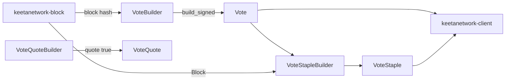

# Vote

## Abstract

This page is the internal design of `keetanetwork-vote`. The crate turns block hashes into a representative commitment, then compresses votes and blocks into a staple. The client re-exports the consumer-facing vote types.

## Purpose

An engineer reads this page before changing vote construction or adding a second staple type in the client. After reading, the engineer can name the path from `VoteBuilder` to `Vote`, from `VoteQuoteBuilder` to `VoteQuote`, and from `VoteStapleBuilder` to `VoteStaple`.

## Internal design

`builder` owns the three fluent builders. `VoteBuilder` produces `UnsignedVote` or a signed `Vote`. `VoteQuoteBuilder` wraps `VoteBuilder` and forces `quote = true` on the fee schedule. A quote cannot be stapled or used to confirm blocks. `VoteStapleBuilder` collects votes and blocks, applies canonical ordering, and builds a `VoteStaple`.

`vote` owns `Vote`, `VoteQuote`, `UnsignedVote`, and `PossiblyExpiredVote`. A possibly expired vote is parsed and signature-verified. Its validity window may have ended.

`staple` owns `VoteStaple`. `Vote::verify` decodes bytes, rejects non-canonical DER, and checks the issuer signature. `VoteStaple::verify` also enforces canonical ordering, an agreed block set, a single issuer, and uniform permanence at a caller-supplied moment.

`cert` owns certificate-shaped encoding that uses account `CertSigner`. `fee` owns `Fee` and `Fees` as `Single` or `Multiple`. `validity` owns the validity window. `hash` owns `VoteBlockHash`, `VoteHash`, and `VoteStapleHash`. `validation` owns `ValidationConfig`. `error` owns `VoteError`. `testing` is present when the `testing` feature is on.

## Collaboration

Inbound: `keetanetwork-block` supplies `AccountRef`, `Block`, and `BlockHash`. `keetanetwork-account` supplies the issuer and `CertSigner`. `keetanetwork-crypto` supplies signatures. `keetanetwork-asn1` supplies vote transport codecs.

Outbound: `keetanetwork-client` re-exports `Vote`, `VoteQuote`, `VoteStaple`, and `VoteBlockHash`. `keetanetwork-bindings` and `keetanetwork-client-wasi` project vote types at host ABIs.

## Feature contract

Default features are `std` and `rasn`. `std` implies `alloc`. Features `der` and `rasn` forward to asn1, account, crypto, and block. A `no_std` consumer enables `alloc` and at least one codec.

## Falsified by

A change to `Vote`, `VoteQuote`, `VoteStaple`, or `PossiblyExpiredVote` ownership. A change that drops the client re-export of `Vote`, `VoteQuote`, or `VoteStaple`. A change to the rustdoc example in `keetanetwork-vote/src/lib.rs`.
