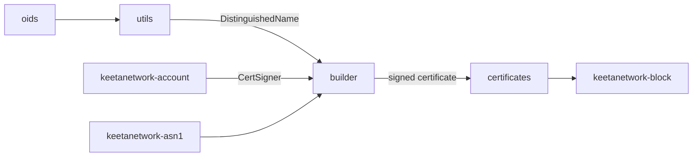

# X.509

## Abstract

This page is the internal design of `keetanetwork-x509`. The crate builds, stores, and validates certificates. Account crate traits sign and verify those artifacts. This crate does not grow a second signer trait.

## Purpose

An engineer reads this page before adding a certificate builder in another crate. After reading, the engineer can name the module that owns builders, certificate types, distinguished names, and validation.

## Internal design

`builder` owns `CertificateBuilder` and `ExtensionBuilder`. A builder assembles subject, issuer, serial, validity, and extensions, then signs through `CertSigner` on the account crate.

`certificates` owns the parsed certificate types and verification entry points. `utils` owns `create_dn` and other name helpers. `oids` owns certificate object identifiers. `asn1` owns crate-local ASN.1 helpers used by builders. `error` owns `CertificateError`.

`serde` is present when the `serde` feature is on. `testing` and `doc_utils` are test and rustdoc helpers.

## Collaboration

Inbound: `keetanetwork-account` supplies `CertSigner` and `CertVerifier`. `keetanetwork-asn1` and `keetanetwork-crypto` supply encodings and key material. `keetanetwork-utils` with the `build` feature supports the crate build script.

Outbound: `keetanetwork-block` depends on this crate so a block can carry certificate material. `keetanetwork-bindings`, `keetanetwork-client-wasm`, and `keetanetwork-client-wasi` project certificates at host ABIs.

## Feature contract

Default features are `std`, `serde`, and `rasn`. `std` implies `alloc`. Features `der` and `rasn` forward to `keetanetwork-asn1`, `keetanetwork-crypto`, and `keetanetwork-account`. A `no_std` consumer enables `alloc` and at least one codec.

## Falsified by

A change that moves certificate builders or stores off this crate. A change that adds a signer trait on this crate that duplicates `CertSigner` or `CertVerifier`. A change to the `der` / `rasn` forwarding in `keetanetwork-x509/Cargo.toml`.
